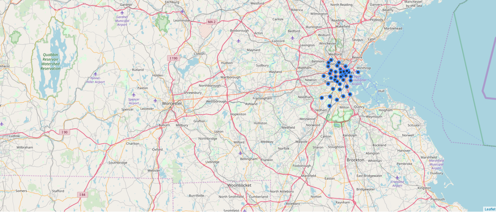

# Applied-Data-Science-Capstone---Final-Project
As a part of the final IBM Capstone Project, I will do a project to understand what data scientists go through in real life. Objectives of the final assignments were to define a business problem, look for data in the web and, use Foursquare location data to compare Boston City (choice of city depends on the students) to figure out which neighborhood is suitable to open a Gym/Fitness Center in and around the City. As prepared for the assignment, I go through the problem designing, data preparation and final analysis section step by step. Detailed codes and images are given in Github and link can be found at the end of the post.

1. Discussion and Background of the Business Problem:
Problem Statement: Prospects of finding a suitable neighborhood to open a Gym/Fitness Center
Massachusetts is the best state in the union for millennials, according to a new report.
Financial literacy site WalletHub ranked the 50 states and the District of Columbia on dozens of measures such as quality of life, housing, and education and health; and found that our very own commonwealth ranked at the top, just ahead of D.C.
Massachusetts scored particularly high among shares of millennials with health insurance and when it came to average monthly income.
Still, though, the top-place finish is a little startling given the state’s high housing costs (particularly in the eastern half that the Boston region dominates), its worst-in-America congestion, and its generally high cost of living.
. Massachusetts’ unemployment rate is 3.5 percent, lower than the national rate. And remunerative industries—tech and life sciences in particular—animate much of the state’s economy. (According to https://boston.curbed.com/2019/4/9/18302352/massachusetts-millennials).
When selecting a place to open a Gym, couple of items Millennials consider e.g. Proximity to Financial district, proximity to public transport (Airport, Train station, Sub-way, ground transport), health food stores, Caffe,and not enough Gym/Fitness center around.
With this analysis we will go through the benefit and pitfalls of staying close to Boston Museum of Science.
We will go through each step of this project and address them separately. I first outline the initial data preparation and describe future steps to start the battle of neighborhoods in Boston.

Target Audience
What type of clients or a group of people would be interested in this project?
•	All Millennials moving to Boston
•	All residents looking for suitable fitness center in their neighborhood residential area
•	Freelancer who loves to have their own Gym/Fitness Center as a side business. This analysis will give an idea, how beneficial it is to open a new Gym and what are the pros and cons of this business.
•	Budding Data Scientists, who want to implement some of the most used Exploratory Data Analysis techniques to obtain necessary data, analyze it, and, finally be able to tell a story out of it.

Section 2: Data Preparation
Data Description
In this section, I will describe the data used to solve the problem as described previously.
As noted below in the Further Development Section, it is possible to attempt quite complex and sophisticated scenarios when approaching this problem. However, given the size of the project and for simplicity only the following scenario will be addressed:
1.	Query the FourSqaure website for the top sites in Boston
2.	Use the FourSquare API to get supplemental geographical data about the top sites
3.	Use the FourSquare API to get most common venues closest to each of the top communities

2.1. Scrapping from US Zip Codes from 2013 Government Data for Boston
I first make use of some Zip code data page for Boston to scrap the table to create a data-frame. For this, I’ve used requests and Beautifulsoup4 library to create a data-frame containing name of the 32 unique communities for Boston Metropolitan Area. We start as below 
http://archive.boston.com/news/local/articles/2007/04/15/sixfigurezipcodes_city/
http://www.census.gov/geo/maps-data/data/gazetteer.html

After some Data Analysis and Data Cleaning the final Dataset was derived in a Dataframe:

The dataframe has 32 communities.

2.2 Now found out the geographical coordinate of Boston  - 42.3602534, -71.0582912.

Now created a map of Boston with 32 communities superimposed on top of that using Foursquare API. 

2.3. Using Foursquare Location Data:
Foursquare data is very comprehensive and it powers location data for Apple, Uber etc. For this business problem I have used, as a part of the assignment, the Foursquare API to retrieve information about the popular venues around the 32 communities of BostonThe call returns a JSON file and we need to turn that into a data-frame. Here I’ve chosen 100 popular spots for each major districts within a radius of 1 km. Below is the data-frame obtained from the JSON file that was returned by Foursquare —

3.	Visualization and Exploratory Data Analysis
As part of Exploratory Data Analysis, the following five(5) communities were identified as possible locations to open a Gym/Fitness center.
Following steps were followed:
  Group rows by neighborhood and by taking the mean of the frequency of occurrence of each category

Now printed each Community along with the top 5 most common venues and put that into a Data frame

4. Clustering the Communities

Based on Location preference following 5 Communities were selected as possible venues to open a Gym/Fitness Center:

Now Finally Ran the same analysis for the 5 communities based on the venue categories and use K-Means clustering. So our expectation would be based on the similarities of venue categories, these districts will be clustered. I have used the code snippet below —

Five(5) Communities of Boston divided in 3 clusters based on the most common venues obtained from Foursquare Data.
We can represent these 3 clusters in a leaflet map using Folium library as below —

Now show the Gym in the map using Folium for the selected five communities- Brighton, Brookline, Cambridge, Somerville, South Boston

On further analysis plotted current number of Gym/fitness center in those communities:

Results and Discussion:
We reached at the end of the analysis, where we got a sneak peak of the 5 selected communities of Boston and, as the business problem started with benefits and drawbacks of opening a Gym in one of the communities, the data exploration was mostly concentrated on the Gym. I have used data from web resources like Wikipedia, python libraries like Geopy, and Foursquare API, to set up a very realistic data-analysis scenario. We have found out that —
1.	Brighton has least number of Gyms among the five
2.	Brighton however has all other commodities to be selected as a neighborhood:

3.	It will be prudent to open a Gym/Fitness center in Brighton
4.	Since the clustering was based only on the most common venues of each communities, all five chosen communities fall under the same cluster 
5.	Due to close proximity to Bus Station, Coffee Shop and other food stores, this will be good location to open Gym/Fitness Center.

6. Conclusion
This finally concludes this project, We have got a small glimpse of how real life data-science projects look like. 
I chose Boston as my choice of city and ran a detail analysis on it’s neighborhood as a possibility of opening a Gym.
Based on our analysis, Brighton will be a suitable neighborhood as a business location with it’s upcoming influx of new office building and close proximity to Bus Station and all other good amenities a good neighborhood has.
Potential for this kind of analysis in a real life business problem is discussed in great detail. Hopefully, this kind of analysis will provide you initial guidance to take more real-life challenges using data-science. There are multiple challenges in finding suitable data which is a drawback for this kind of analysis.
Further Development:
In future I would like to run further analysis on Boston’s Rent data and new construction coming up in the communities.

